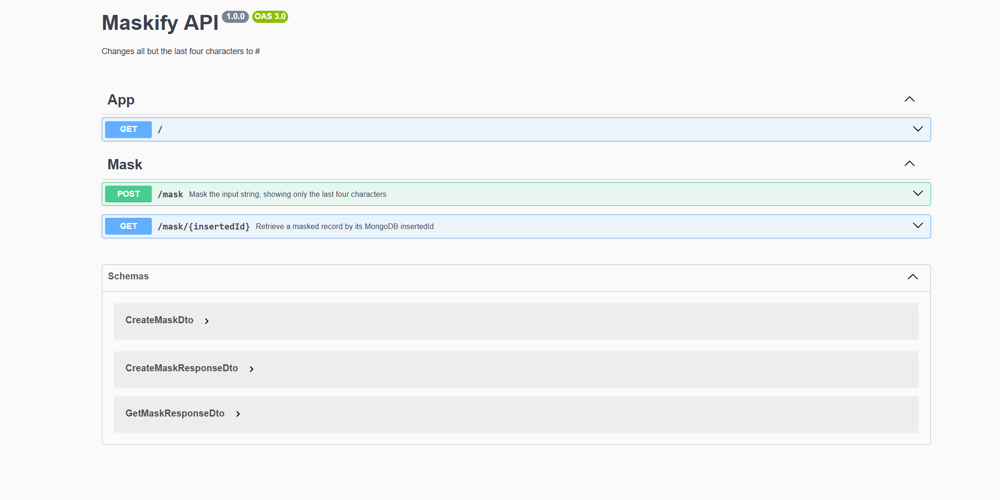

# Last-Four-Characters API

A lightweight and efficient **NestJS backend service** that masks all but the last four characters of any input string.  
The application integrates with **MongoDB Atlas** for persistence and caching, and exposes interactive API documentation through **Swagger**.

---

## Overview

This service provides two main endpoints:
1. `POST /mask` – Masks an input string and stores the result in MongoDB (cached to avoid recomputation).
2. `GET /mask/{insertedId}` – Retrieves a previously masked record by its MongoDB identifier.

The system uses MongoDB as a caching layer. If the same input is submitted more than once, the service returns the same record identifier, demonstrating cache efficiency.

---

## Features

- Mask any input string, leaving only the last four visible characters.
- Cache previous computations in MongoDB to prevent redundant operations.
- Consistent identifiers for identical input values.
- Automatically generated API documentation via Swagger.
- Connection pooling and error handling for database operations.
- Deployable on [Vercel](https://vercel.com) using serverless functions.

---

## Technology Stack

| Layer | Technology |
|--------|-------------|
| Framework | [NestJS](https://nestjs.com) |
| Language | TypeScript |
| Database | MongoDB Atlas |
| Deployment | Vercel (Serverless Functions) |
| API Documentation | Swagger / OpenAPI |

---

## Local Setup

### 1. Clone the Repository
```bash
git clone https://github.com/<your-username>/last-four-characters.git
cd last-four-characters
```

### 2. Install Dependencies
```bash
npm install
```

### 3. Configure Environment Variables
Copy the example file:
```bash
cp .env.example .env
```

Then edit `.env` with your MongoDB configuration:
```env
# .env
ENV=local
PORT=3000
MONGODB_NAME=<your-database-name>
MONGODB_URI=<your-mongodb-connection-string>
MONGODB_MASK_COLLECTION=<your-collection-name>
```

### 4. Start the Application
```bash
npm run start:dev
```

Expected output:
```
Connected to MongoDB: <your-database-name>
App running on port 3000
```

---

## API Documentation (Swagger)

Once running locally, Swagger UI is available at:

**http://localhost:3000/api**

This provides a fully interactive API interface where you can:
- Test `POST /mask` and `GET /mask/{insertedId}` endpoints.
- Review example requests and responses.
- Inspect request validation rules and response schemas.

---

## Deployed API (Vercel)

The production deployment is hosted on Vercel:

**Base URL:**  
[https://last-four-characters.vercel.app](https://last-four-characters.vercel.app)

### Example Requests

#### 1. Create a Masked Record
**POST** `/mask`
```bash
curl -X POST https://last-four-characters.vercel.app/mask   -H "Content-Type: application/json"   -d '{"chain":"4556364607935616"}'
```

**Response**
```json
{
  "original": "4556364607935616",
  "masked": "############5616",
  "insertedId": "67068d5b2f79a8a72a0e16fb"
}
```

If the same string is sent again, the same `insertedId` will be returned (cache hit).

#### 2. Retrieve a Masked Record
**GET** `/mask/{insertedId}`
```bash
curl https://last-four-characters.vercel.app/mask/67068d5b2f79a8a72a0e16fb
```

**Response**
```json
{
  "internal_id": "1728402800000-6d8a5b97-f6d2-4e9e-b27d-c4a2c3de9ed3",
  "ip": "181.51.78.203",
  "original_chain": "4556364607935616",
  "masked_chain": "############5616",
  "created_at": 1728402800000
}
```

If the record does not exist, a `404 Not Found` response is returned.

---

## API Flow Summary

1. **POST /mask**
   - Checks MongoDB for an existing record by `original_chain`.
   - If found, returns the same `insertedId` (cache hit).
   - If not found, creates and stores a new record with a timestamp.

2. **GET /mask/{insertedId}**
   - Queries MongoDB by ID.
   - Returns the full record, excluding MongoDB’s internal `_id` field.

---

## Example Workflow

```bash
# Start local server
npm run start:dev

# Create a masked record
curl -X POST http://localhost:3000/mask   -H "Content-Type: application/json"   -d '{"chain":"4556364607935616"}'

# Repeat request (cache hit)
curl -X POST http://localhost:3000/mask   -H "Content-Type: application/json"   -d '{"chain":"4556364607935616"}'

# Retrieve record by ID
curl http://localhost:3000/mask/<insertedId>
```

You can also use Swagger UI to interact with the API.

---

## Notes

- MongoDB connection pooling is managed automatically.
- All timestamps (`created_at`) are numeric UNIX epoch values in milliseconds.
- Works seamlessly in both local and Vercel serverless environments.
- Ensure your MongoDB cluster is accessible from your deployment region.

---

## License
MIT License. You are free to use, modify, and distribute this code.

---

## Author

**Brayan Cepeda**  
Software Engineer | Backend & Cloud Specialist  
[LinkedIn](https://www.linkedin.com/in/brayan-rivera-cepeda-65a273139)  NestJS, FastAPI, Pulumi, GCP, AWS, Web3
